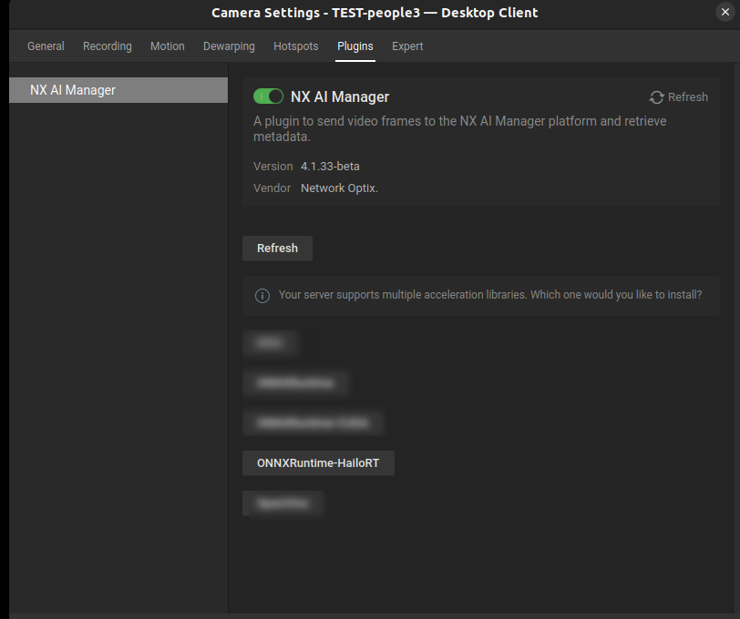
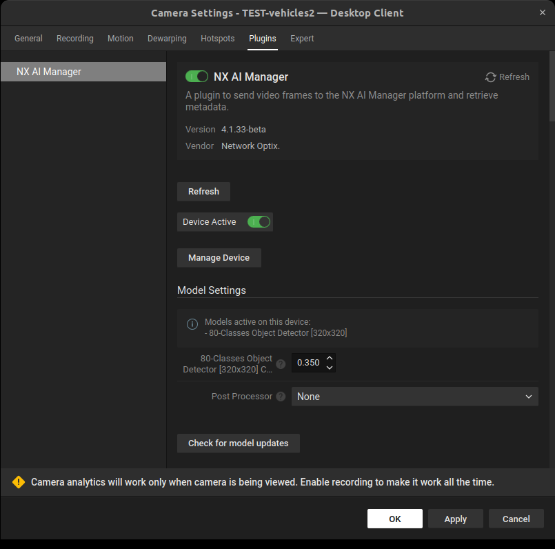
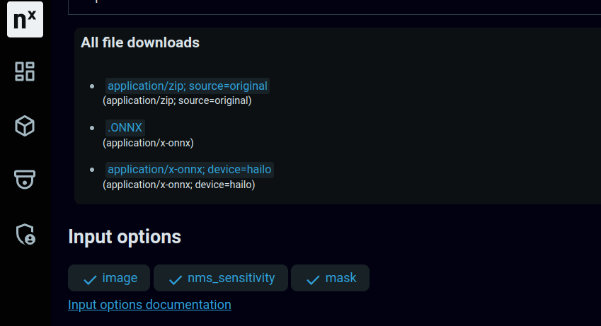

# Hailo Support

It's currently possible to convert Teachable Machine models to the Hailo-ONNX format on the cloud.

Other generic ONNX models need to be locally compiled by the user using the Hailo dataflow compiler, and then the generated file needs to be uploaded to the Nx AI Cloud. This is due to the nature of compiling ONNX models in Hailo format. For this the user needs to upload calibration images and specify the subgraph that the Hailo chips can accelerate. This is not possible in the available cloud conversion.

### Deploying on x86\_64 machine with Hailo-8

1. The first step is to verify that you have a compatible HailoRT driver installed. Please check out this [table](supported-ai-accelerators.md) to determine if your driver version is supported.
2. Next, install the Nx AI plugin by following [these instructions](../nx-ai-manager/2.-install-nx-ai-plugin.md).
3. If all is well, you should be able to select the Hailo runtime when enabling the Nx plugin as shown below:



4. After the installation is finished, the plugin interface will look something like this:



5. To manually verify that the Hailo runtime is downloaded and set up, feel free to check out the content of the `bin` folder of the AI Manager and make sure it contains these files:\
   \- libhailort.so.4.xx.0\
   \- libonnxruntime\_providers\_hailo.so\
   \-libonnxruntime\_providers\_shared.so\
   \- libRuntimeLibrary.so

```sh
ubuntu@ThinkStation-P360-Tower:~$ ls /opt/networkoptix-metavms/mediaserver/bin/plugins/nxai_plugin/nxai_manager/bin/
installed_runtime.txt libhailort.so.4.17.0 libonnxruntime_providers_hailo.so libonnxruntime_providers_shared.so libRuntimeLibrary.so sclbld sclblmod
```

6. Finally, to deploy a model that can be accelerated on the Hailo chip, make sure that it has a `application/x-onnx; device=hailo` model file in the Nx AI Cloud:



If that is not the case, you'll need to manually compile the ONNX model and upload the generated model to the cloud. Please refer to [this](https://github.com/OAAX-standard/contributions/tree/main/Hailo-8) page for a quick start guide.

### Common issues

* Sometimes, after compiling an ONNX model to a Hailo-ONNX, the input names and shapes are _not_ kept intact. Hence, the model might not work correctly within the Nx AI Manager. \
  So, please make sure that the generated ONNX conforms to our specifications.

### Monitoring

**How to Enable Hailo Monitoring with `hailortcli monitor`**

To monitor Hailo usage with the `hailortcli monitor` command, you need to set a specific environment variable. Follow these steps:

1.  **Edit the Media Server Service Configuration:**\


    Add the following line to the `/etc/systemd/system/networkoptix-metavms-mediaserver.service` file to set the necessary environment variable:\


    ```plaintext
    Environment="HAILO_MONITOR=1"
    ```

    \
    The updated configuration file should look like this:\


    ```plaintext
    [Unit]
    Description=Network Optix Media Server
    After=network.target local-fs.target remote-fs.target
    Requires=networkoptix-metavms-root-tool.service

    [Service]
    PermissionsStartOnly=true
    ExecStartPre=/opt/networkoptix-metavms/mediaserver/lib/scripts/systemd_mediaserver_pre_start.sh
    ExecStart=/opt/networkoptix-metavms/mediaserver/lib/scripts/systemd_mediaserver_start.sh
    User=networkoptix-metavms
    Group=networkoptix-metavms
    Restart=always
    TimeoutStopSec=120
    KillMode=process
    TasksMax=8191
    LimitCORE=infinity
    Environment="HAILO_MONITOR=1"

    [Install]
    WantedBy=multi-user.target
    ```
2.  **Restart the NX Media Server:**\


    After updating the configuration file, restart the Network Optix Media Server for the changes to take effect. You can do this by running one of the following commands:\


    ```bash
    sudo systemctl restart networkoptix-metavms-mediaserver.service
    ```

    \
    or\


    ```bash
    sudo service networkoptix-metavms-mediaserver restart
    ```
3. **Run hailortcli**\
   &#x20;\
   `HAILO_MONITOR=1 hailortcli monitor`

<figure><figcaption></figcaption></figure>
