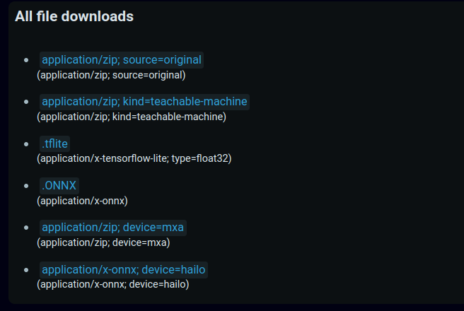

# Introduction

The Nx AI Manager accelerates AI models inference using various built-in **runtimes**, each of which is dedicated to a specific platform and AI accelerator (CPU, GPU, NPU, etc.). These runtimes are seamlessly integrated within the AI Manager, facilitating effortless utilization for individuals employing new runtimes and harnessing various forms of AI acceleration.&#x20;

When a user uploads a [supported](../for-data-scientists/importing-models/) AI model to the Nx AI Cloud, the uploaded model file is subject to several conversion processes, **each of which generates a new model artifact that is used by one of the** [**runtimes**](supported-ai-accelerators.md) **that are provided.**

### Example of a Teachable Machine model

Suppose you've trained a teachable machine model, and exported it according to the guidelines mentioned [here](../for-data-scientists/importing-models/from-teachable-machine.md), the following model artifacts are stored to be used by the Nx AI Manager when needed:

<figure><figcaption></figcaption></figure>

* `application/zip; source=original`: is the original ZIP archive that's uploaded in the interface.
* `application/zip; kind=teachable-machine`: is the same file that's uploaded but with a different MIME type after detecting its nature.
* `application/x-tensorflow-lite; type=float32`: is the TFLite file that's extracted from the TM archive.
* `application/x-onnx`: the TFLite  generated in an earlier stage is converted to ONNX, validated and optimized to run on both **CPU** and **Nvidia** hardware.\
  _Please note, that in this step, no quantization is performed on the model._
* `application/zip; device=mxa`: is the artifact generated by compiling the ONNX file into an optimized file dedicated only for MemryX hardware.
* `application/x-onnx; device=hailo`: is a custom ONNX generated specifically for Hailo-8 chips.


Any runtime/toolchain combination adhering to the [Open AI Accelerator eXchange (OAAX)](https://www.oaax.org/) standard is compatible with the Nx AI Manager, enabling straightforward substitution of any existing installed runtime with new one.\
If you're a AI chip maker and would like to integrate with the Nx AI Manager, please refer to this documentation repository on [Github](https://github.com/OAAX-standard/OAAX).

