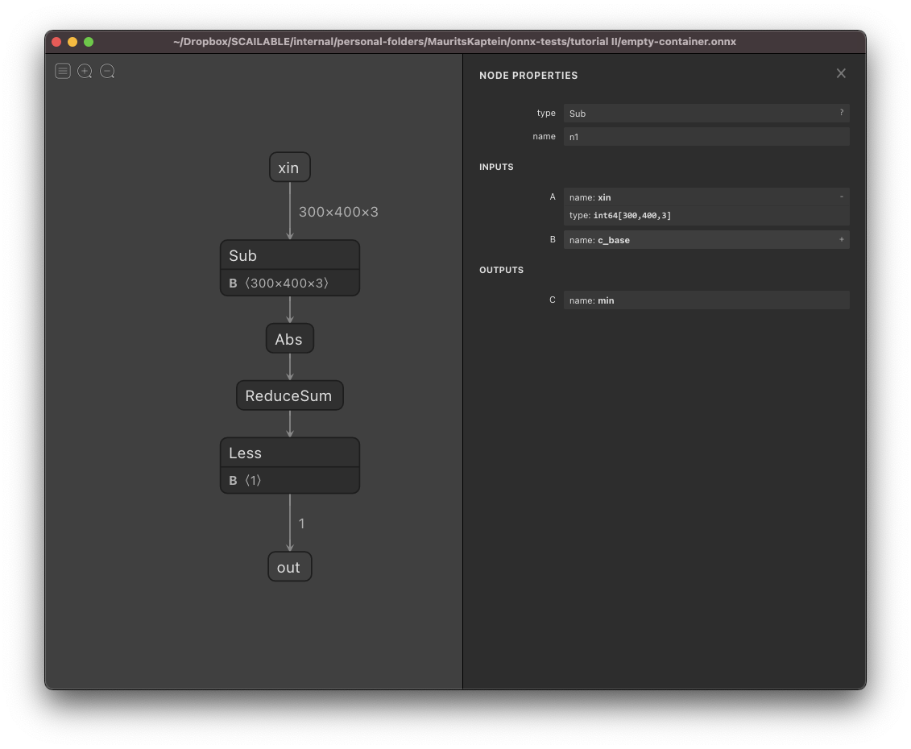

# About ONNX

[ONNX](https://onnx.ai) (stands for **O**pen **N**eural **N**etwork **E**xchange) provides a standardized file structure to store trained AI and ML pipelines. Although ONNX is mostly used to store a fitted model (i.e., to export a model from some training platform or framework), we use it more broadly to create full data processing pipelines (also known as _computational graph_) and to merge and combine models flexibly. Before reading the docs on [custom model creation](custom-model-creation.md) using ONNX, it is useful to have a general understanding of ONNX.


The ONNX ecosystem is [rapidly advancing](https://onnx.ai/about.html): more and more model training platforms support exporting to ONNX (and thus can be used to create models for edge deployment using the Nx AI manager). We are active contributors to the ONNX ecosystem.&#x20;


### A short ONNX introduction

According to the official [ONNX website](https://onnx.ai/index.html):

_”ONNX is an open format built to represent machine learning models. ONNX defines a common set of operators — the building blocks of machine learning and deep learning models — and a common file format to enable AI developers to use models with various frameworks, tools, runtimes, and compilers.”_

Thus, ONNX is an open file format to store (trained) machine learning models/pipelines containing sufficient detail (regarding data types, etc.) to move from one platform to another. The specificity of ONNX allows one to _automatically_ compile the stored operations in lower-level languages for embedding on various devices. Effectively, an onyx file will contain all you need to know to instantiate a full data processing pipeline when moving from one platform to the other. It contains a full description of the process of turning the model input (for example, an image coming from a camera) into the desired output (for example, a count of the number of people in front of the camera).

Conceptually, the ONNX format is easy enough: An ONNX file defines a [directed acyclic graph](https://en.wikipedia.org/wiki/Directed_acyclic_graph) in which each edge represents a tensor specifying data of a specific type that is “moving” from one node to the other. The nodes themselves are called [operators](https://github.com/onnx/onnx/blob/master/docs/Operators.md) and specify operations on their inputs (i.e., the results of their parent nodes in the graph) and submit the result of their operation to their children. [ONNX](https://onnx.ai/)  thus specifies a list of operations that jointly allow one to specify virtually any AI/ML operation you might want to carry out (and if not, the set of operators is easily extendable).

### A simple example

The figure below shows an example of an ONNX graph rendered using Netron for rudimentary image processing (see [this medium post](https://towardsdatascience.com/onnx-for-image-processing-from-scratch-6694f9b141b0) for details). This graph can detect movements in front of a camera with an otherwise static background.

The logic of the graph is easy enough to follow:

* At the top, we have the start node (or named input) that is called `xin`. It is a `in64` tensor of dimensions 300x400x3: Effectively, this encodes passing a color image of 300 by 400 pixels with 3 color channels, which are each encoded using `int64`.
* In the second `Sub` node, the input image is simply pixel-by-pixel and subtracted from another image (called `B` in this graph: simply a static image encoding the static background). A full list of ONNX operators can be found [here](https://github.com/onnx/onnx/blob/main/docs/Operators.md).
* After the input image and the background have been subtracted, the `Abs` node is used to compute the absolute value of the difference between the values. This is again done pixel-by-pixel. The result is effectively an image encoding all that is left of the input image after subtracting the static background.
* Next, the `ReduceSum` node sums over all pixels to generate a single number that quantifies the difference between the input image and the static background.&#x20;
* Finally, a simple `Less` check is used to see if there is a difference between the input image and the background that is large enough to conclude that something has appeared in front of the camera: the `out` node is simply a boolean value indicating whether something has appeared in front of the camera.

