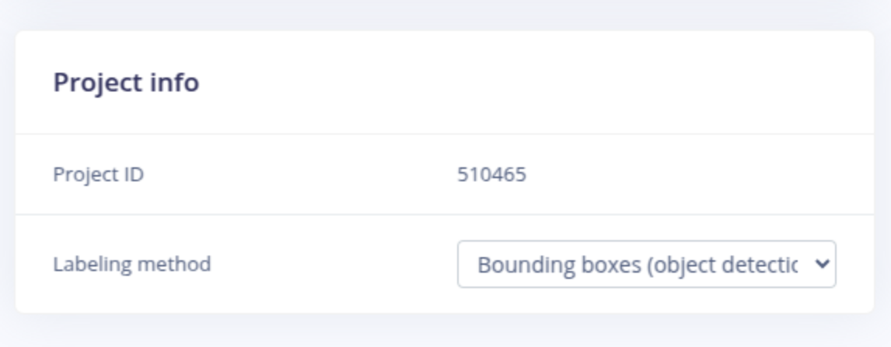

# From Edge Impulse

## About Edge Impulse

.png>)

_"Edge Impulse is the leading development platform for machine learning on edge devices, free for developers and trusted by enterprises."_ You can find the Edge Impulse training platform [here](https://www.edgeimpulse.com).

## Preliminaries

In this section of our documentation we describe how to use the [Edge Impulse model training platform](https://edgeimpulse.com) to train advanced machine learning models for vision tasks and deploy them seamlessly using the [Nx AI cloud](broken-reference). To follow the documentation at this point we assume that you have access to the following:

* An edge device with the Nx AI manager installed. If you do not have access to an edge device with the Nx AI manager installed please see how to purchase a device. Do make sure you can login to the edge device and navigate to the [AI manager installed on the device](broken-reference).
* A camera that can be used as an input source in Nx Meta as well as in stan-alone mode.
* A Nx AI cloud account. You can register for a free trial account at [https://admin.sclbl.net/register](https://admin.sclbl.net/register). However, the Edge Impulse integration will need to be activated for your account by our support team; the quickest way to get that done is by reaching out [through our chat](https://scailable.net/chat/).
* An Edge Impulse account. Sign up for a free Edge Impulse account at [https://studio.edgeimpulse.com/](https://studio.edgeimpulse.com/).

Once you have all of the above setup, you should be able to proceed to train your own model using edge impulse and deploy it using Nx AI Manager.&#x20;

## Quick overview

We will demonstrate how to train and deploy your own model step-by-step. And, we will show you how to re-train your model once it has been deployed in-the-field. We will cover the following steps:

1. **Model training using the Edge Impulse platform**. Note that we will not provide an elaborate walk through of the amazing capabilities of the Edge Impulse platform; these can be found in the Edge Impulse docs: [https://docs.edgeimpulse.com/docs/](https://docs.edgeimpulse.com/docs/).
2. **Coupling your Edge Impulse model with Nx AI cloud**. We will show how to sync your Edge Impulse model with your model catalog.
3. **Deploying (and testing) your model on your edge device**. This section will detail how to deploy your Edge Impulse model effortlessly to your edge device using the [Nx AI cloud](broken-reference).&#x20;
4. **Retraining your model**. This step is optional, but cool. Once you have a model setup you can collect new training examples in the field and use these to retrain a model. Once done you can iterate (go back to step 1) and get better!

## 1. Model training using the Edge Impulse platform

We start the development of a novel edge AI solution by creating a new project on the Edge Impulse platform:

The Edge Impulse platform is very intuitive, and allows you to upload and annotate training examples and to train object detection models. We will focus on the Edge Impulse's Yolov5 model; find a quick getting started guide here: [https://docs.edgeimpulse.com/docs/tutorials/detect-objects-using-fomo](https://docs.edgeimpulse.com/docs/tutorials/detect-objects-using-fomo).

The important bit for this tutorial is to train an object detection model and to select the correct Yolo models. Work through the data acquisition and impulse creation steps in the Edge Impulse platform to get to the object detection model:

Do make sure to select the **FOMO MobileNetV2 (both 0.1 and 0.35), or Yolov5 option**. Next, after you have clicked "Start training" and the model training has finished, you are done (for now) on the Edge Impulse platform.


At this point we **only** support imports of the **FOMO MobileNetV2 and Yolov5** from Edge Impulse. We will be adding support for more Edge Impulse models shortly.


## 2. Coupling your Edge Impulse model with Nx

After training your model, you can leave the Edge Impulse platform (but do leave it open in a tab) and move to [https://admin.sclbl.nxvms.com/](https://admin.sclbl.nxvms.com/). After logging in at the Nx AI cloud you will arrive at your dashboard showing your current models and devices (which might both be 0 when you are just getting started):

Click the model tab on the left, and next click the  "Add a model" button:

You will arrive at the model upload page, from where you can [select "linking an Edge Impulse project](https://admin.sclbl.net/link-edgeimpulse)". Yes, you can also just click [this](https://admin.sclbl.net/link-edgeimpulse) link. This all should get you here:

At this point you can use your Edge Impulse API key and project ID to import your trained model directly from Edge Impulse.

* Your Project ID is located on the project info page in a separate box, or as the last item in the URL:

<figure><figcaption></figcaption></figure>

* Your API key can be found at your dashboard:

<figure><figcaption></figcaption></figure>

After filling out the API- and project- keys you can click the "Link model" button, and your Edge Impulse model will be imported into your Nx AI library:

<figure><figcaption></figcaption></figure>

You can obviously change the model name and documentation (as usual), but effectively, after the import, the model is directly available for deployment. Once you click "Return to models" you will see the model on the top of you model list:

<figure><figcaption></figcaption></figure>

You are now ready to deploy your model to your selected edge device.

## 3. **Deploying (and testing) your model on your edge device**

In Nx Meta, connect to your system and open the plugin page.

<figure><figcaption></figcaption></figure>

Click "Manage device" and select the model you created.

<figure><figcaption></figcaption></figure>

And click on "Use this model" return to the plugin.

The video feed should then show some detection boxes when you activate the object tab.

<figure><figcaption></figcaption></figure>

That's it really; you have just trained and deployed a pretty nifty AI model to your edge device.

## 4. **Retraining your model**

Although steps 1 to 3 basically got you started, there are a few nice tricks you can use to improve your solution over time. Particularly, you can set the on-device AI manager to capture new training images when needed.&#x20;

Set up a [postprocessor](https://github.com/scailable/sclbl-integration-sdk/tree/main/postprocessor-python-edgeimpulse-example) from the integration SDK for image uploads. You can set the postprocessor up to send images every `N` seconds or when the result is below a certain `P` value.

Let the system run with the postprocessor for a while.

At this point you can navigate back to your Edge Impulse project, label the uploaded images, retrain the model, and then [re-deploy your model](from-edge-impulse.md#3.-deploying-and-testing-you-model-on-your-edge-device).

## Wrap up

The above covers the basics of "training-using-Edge-Impulse-deploying-using-Nx". Very cool stuff, and in this article we really only scratched the surface of the potential applications. If you want to learn more, feel free to [reach out anytime](https://scailable.net/chat/).
