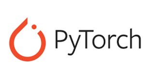

# From PyTorch

## About PyTorch

[PyTorch](https://pytorch.org) is a [machine learning](https://en.wikipedia.org/wiki/Machine_learning) [framework](https://en.wikipedia.org/wiki/Software_framework) based on the [Torch](https://en.wikipedia.org/wiki/Torch_\(machine_learning\)) library, used for applications such as [computer vision](https://en.wikipedia.org/wiki/Computer_vision) and [natural language processing](https://en.wikipedia.org/wiki/Natural_language_processing), originally developed by [Meta AI ](https://en.wikipedia.org/wiki/Meta_AI)and now part of the [Linux Foundation](https://en.wikipedia.org/wiki/Linux_Foundation) umbrella. It is [free and open-source software](https://en.wikipedia.org/wiki/Free_and_open-source_software) released under the [modified BSD license](https://en.wikipedia.org/wiki/Modified_BSD_license). Although the [Python](https://en.wikipedia.org/wiki/Python_\(programming_language\)) interface is more polished and the primary focus of development, PyTorch also has a [C++](https://en.wikipedia.org/wiki/C%2B%2B) interface.

## Model deployment from PyTorch

Model deployment from PyTorch is simple to achieve by exporting your PyTorch model to ONNX and subsequently using (if neccesary) the `sclblonnx` package to [clean and check the resulting graph](../onnx-requirements.md#automatic-checking-using-the-sclblonnx-check-function) for an upload to the Nx AI cloud.&#x20;

* You can find details on PyTorch to ONNX exports [here](https://pytorch.org/tutorials/advanced/super_resolution_with_onnxruntime.html). You can find an insightful tutorial [here](https://deci.ai/blog/how-to-convert-a-pytorch-model-to-onnx/).
* You can find an example using PyTorch and sclblonnx [here](https://github.com/scailable/sclblonnx/blob/master/examples/example_03.py).

After obtaining a [clean ONNX graph that adheres to our requirements](../onnx-requirements.md), you can [upload it to the Nx AI cloud](../../nx-ai-cloud/upload-your-model/) for deployment.
