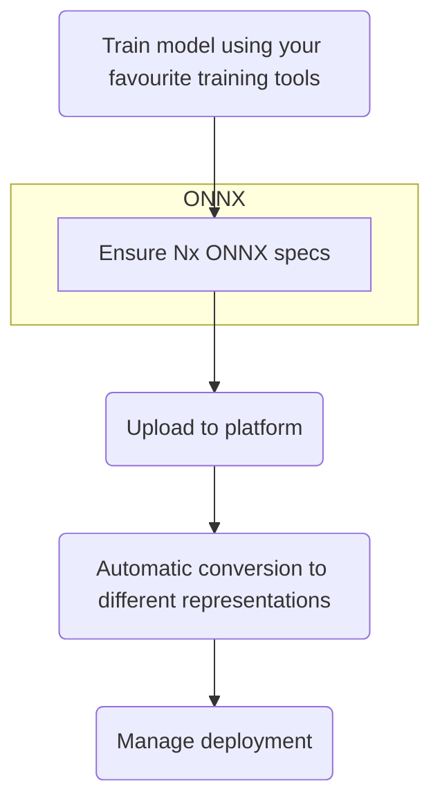

# Introduction

&#x20;This section of our documentation describes how to create vision models that can be easily deployed to your edge devices running Nx Meta Server.&#x20;


This section of the docs focuses on creating models. Once you have a model ready in ONNX format, you [can find instructions on uploading it to the Nx Cloud platform here](../nx-ai-cloud/upload-your-model/).&#x20;


## High-level process

Our standard process for creating and uploading your models to the Nx AI Cloud is to:

1. Create a model using your favorite training tools. You can create an [ONNX model/pipeline from scratch](custom-model-creation.md) or import a model using one of the training tools we integrate with.
   1. If you create your ONNX from scratch, ensure the [resulting ONNX graph is proper](onnx-requirements.md).
2. Once you have your model ready, you can upload it to the Nx AI Cloud platform; we will automatically convert it to several different device-type optimized versions and ensure that it can be deployed to any edge device running the Nx AI manager efficiently.

In this section of the docs, you can find the following:

* General [information and resources regarding ONNX](about-onnx.md).
* Details on how to [generate your own ONNX graphs](custom-model-creation.md) and how to check your ONNX graph.
* Details on how to import models that have been [exported from various model training platforms](importing-models/).

