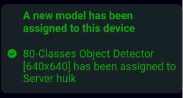

# Deployment and device management

The Nx AI Cloud platform allows you to (mass) deploy model pipelines to target devices. Effectively, you can "swap" the models that run on a device (configured using the [AI manager](broken-reference)) remotely and change the device configuration. The latter you can do at a large scale: you can deploy models to all the devices on a server.

## An overview of your sites and devices

The Sites tab on the Nx AI Cloud platform shows all systems registered to your cloud account.&#x20;

If the system is on-online the name of the system and the Details button are available.

<figure><figcaption>
overview of sites with one on-line system
</figcaption></figure>

If the site is off-line you cannot continue until the system comes on-line.

<figure><figcaption>
listing of one site that is off-line
</figcaption></figure>

## Overview of a single site

If you select an on-line site you are directed to the site details page.

<figure><figcaption>
overview of a single on-line system
</figcaption></figure>

The page shows the servers in the site and lists all the devices and their groups.

The same page when the site is off-line. You cannot do anything now.

<figure><figcaption>
overview of a single off-line system
</figcaption></figure>

## AI model pipeline deployment and management

You can assign or replace a model pipeline on a single device or you can select multiple devices and assign a single model pipeline to all the selected devices.

### Assign or replace a model pipeline on a single device

To assign or replace a model on a single device you need to click on the 'Details' button on the system or server page. You will be directed to the device page.

<figure><figcaption>
Overview of a single device in the system
</figcaption></figure>

To assign an additional model pipeline to the device you can press 'Add a new pipeline' or the 'add' button. To replace a model pipeline press the button with the left-right arrow in it.

You will be directed to the 'Models listing'.

On the top you get a new notification bar that shows you are currently in assigning mode. You can use that to go back to the models listing page, back to the device or cancel the whole assignment process.

Once you have found the model you want to assign or replace use the button 'Add to \[x] pipeline'.&#x20;

<figure><figcaption>
models listing
</figcaption></figure>

Now, the model pipeline will be deployed and if all is well you will see the following notice and you are redirected to the device page.

<figure><figcaption></figcaption></figure>

### Assign a single model pipeline to all the selected devices

To start you need to be on the site or server page, which shows you all the servers and all devices in the site.

Just below the 'Devices' header on this page there is a link called 'here' which starts the process of selecting devices to assign a model pipeline to.

<figure><figcaption></figcaption></figure>

Once pressed, a new column with checkboxes will be added to the devices and you can use them to select the devices you want to assign a new model pipeline to.

<figure><figcaption>
multiple server selection activated
</figcaption></figure>

If you select one or more servers the 'Assign a new pipeline' will activate. Pressing this button will start the model assignment just like updating a model for a single device.

Note: assigning a model pipeline to multiple devices will always remove all other pipelines and replace them with the new pipeline you selected.
