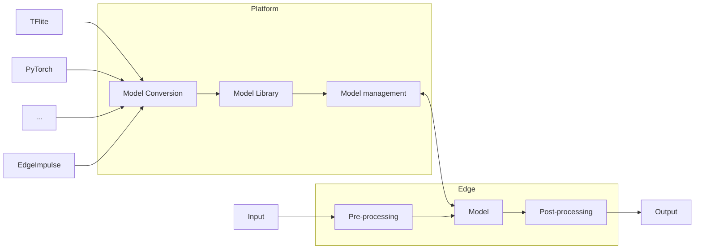

# Introduction

In this section of our documentation, we describe the Nx AI Cloud platform. The Nx AI Cloud platform effectively allows for the following:

* The Nx AI Cloud platform allows you to manage all the AI models that are available to you. Thus, you can see which AI models you can access, for which devices, and you can manage the version(s) of your user-generated models.
  * For [data scientists](broken-reference), the Nx AI Cloud platform allows for the conversion of your own models.
* The Nx AI Cloud platform allows you to (mass) deploy models to target edge devices. Effectively, you can "swap" the models that run on an edge device (configured using the [NX AI manager](broken-reference)) remotely and change the device configuration.
  * The latter can be done at a large scale: you can flexibly group devices and deploy models to groups of devices.

The following diagram shows some of the functions of the Nx AI Cloud platform and the relationships between the edge device(s) and model training platforms.

In the next sections, we detail each functionality. However, first, we describe how you can register for the platform.
