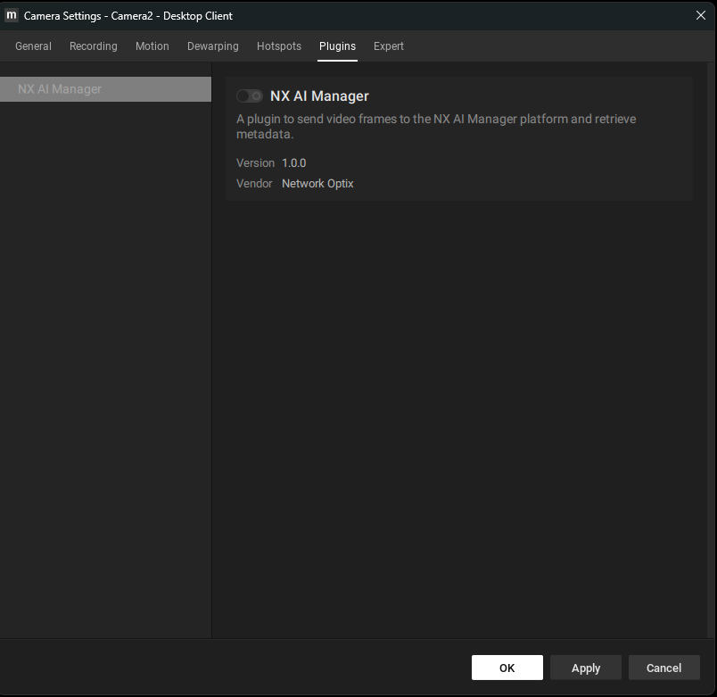

# 3. Configure the Nx AI Manager plugin

Configure Network Optix Meta

After successful installation of NX Server and Client, a 'Plugins' tab should be visible when opening a camera's settings:

<figure><figcaption>
Camera Settings Navigation
</figcaption></figure>

The plugin can be enabled/disabled per camera on the Plugins tab:

<figure><figcaption>
Nx AI Manager Plugin Tab
</figcaption></figure>

#### Visualizing Bounding Boxes

If a model that outputs compatible bounding boxes is selected and running the Edge AI Manager, bounding boxes can be visualized by visiting the _Objects_ tab on the right pane in the NX Meta Client:

<figure><figcaption>
Visible Bounding Boxes in NX Meta Client
</figcaption></figure>

#### Adding Event Rules

The Nx AI Manager plugin can generate several different types of events. Network Optix gives the user control over what these events should do, from sending an email to showing a notification. In this example, we will show a text overlay on the video.

Rules can be added by navigating to the Camera Rules menu:

<figure><figcaption></figcaption></figure>

On the Event Rules window, click the **Add** button to add a new rule.&#x20;

From here, several options are available. First, on the left side, select **Analytics Event** from the **When** context menu. This is the type of event the Nx AI Manager plugin generates.&#x20;

Select any, or multiple, camera(s) in the **At** context menu.&#x20;

Under the **Event Type** context menu, you will find a number of event types the Nx AI Manager plugin can generate, from alarms to counting objects. In this example, we will select the _Objects Counted_ type.&#x20;

On the right side, it can be configured what should be done when one of these events is triggered. Here you could set up an email or notification trigger. In this example, we will select the Show text overlay option in the **Do** context menu **at** the source camera

<figure><figcaption>
Example Settings for Objects Counted Rule
</figcaption></figure>

If set up correctly, and a model generating counts is selected and running, we should see an overlay on the camera feed showing us the object counts:

<figure><figcaption>
Example of Objects Counted text overlay
</figcaption></figure>
