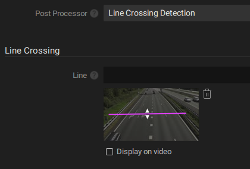

# 4. Other Network Optix Plugin Settings

The Network Optix plugin contains several settings to manage the behavior.&#x20;

Navigate to the camera settings and enable the Nx AI plugin. A number of settings should appear.

## Device Active

If this setting is enabled, the frames from this device's video stream will be sent to the AI Manager for inference. The AI Manager runs as a separate process on the server, and is started if at least one device on the server has this setting enabled.

This setting is off by default. This allows you to configure your device, assign a model, and then enable the device for the first time.

## Manage Device

<figure><figcaption>
The NX Plugin Settings Tab with the Manage Device button
</figcaption></figure>

Clicking this button opens a Client mode popup which you can use to manage this device. In the popup interface you can **assign**, **remove** or **add models** to this device.&#x20;

<figure><figcaption>
The NX Client Popup where models can be managed for a device.
</figcaption></figure>

Changes made in the NX Client Popup will be sent to your device automatically. You may need to click the 'Refresh' button to see your changes in the settings tab.

From this window, you can also manage more devices, servers or sites, with limited functionality compared to the [NX AI Manager](https://admin.sclbl.nxvms.com/) where the full functionality is present.

## Model Cutoff

If you have a model assigned which supports a cutoff input, it will allow you to input a value between 0 and 1. This refers to the required certainty of the model before a detection is made. This value is model and situation specific, and can be tuned per device per model to get the best results.

## Postprocessors

The NX AI Manager platform provides a number of built-in standard postprocessors for convenience. It also allows advanced users to create and add their own custom postprocessors.

A drop-down list is provided from which you can select a postprocessor per camera. When selecting a postprocessor from this list, depending on the postprocessor, additional settings might become available. Click on 'Apply' for changes to take effect.

### Feature Extraction

In some use cases, additional inferences are desired to be run on certain objects. For example, let's suppose you trained a model that can detect whether a person is smoking. This can then be used in tandem with a person detection model. The person detection model would be used to detect people from, say, a surveillance camera and generate bounding boxes for them. If feature extraction is enabled, these bounding boxes will be used to extract parts of the larger image and then sent back to the Edge AI Manager so that the smoking detection model can be run on each detected person.

<figure><figcaption>
Feature Extraction Settings
</figcaption></figure>

**Feature Extraction Model:** Which model to use for the extracted features. This model will be used for inference on each extracted bounding box. A drop-down list is provided with all assigned models in the NX AI Manager.

**Feature Extraction Type:** The type of object to extract from the full image. This is useful for when a detection model produces multiple types of bounding boxes. This setting will be matched to bounding box types, and types matching this setting will be sent to the NX AI Manager for further inference.

**Post Processor:** The features which are extracted and reused for additional inferences can themselves have postprocessing applied. A drop-down list is provided with all known postprocessors.

Feature Extraction is compatible with any model which outputs bounding boxes, see [#supported-onnx-model-outputs](../for-data-scientists/onnx-requirements.md#supported-onnx-model-outputs "mention").

### Loitering Detection

The NX AI Manager has the functionality to detect loitering. This is a tool to detect if a certain object is detected for longer than the desired amount of time.

Loitering detection requires a compatible model, see [onnx-requirements.md](../for-data-scientists/onnx-requirements.md "mention"). It is generally recommended to use loitering detection in tandem with [#feature-extraction](3.-other-network-optix-plugin-settings.md#feature-extraction "mention"), since Identity models generate vectors for their input images, it is useful to first detect objects in a frame, and then send these extracted sub-frames to the Identity model for identification.

The Loitering Detection postprocessor receives the identity data from the AI model along with the location in the larger frame. It then algorithmically matches the identified object to an object detected in previous frames. Finally it calculates how long the identified object has been detected, and compares it to the given threshold.&#x20;

Since this postprocessor works with an Identity model, it can therefore identify an object if it leaves the frame and returns somewhere else, which makes it more reliable than most basic IOU tracking algorithms.

Once it is detected that this subject is loitering, a bounding box of the type Loiterer will be generated to clearly show where this is happening.

<figure><figcaption>
Loitering Detection Settings
</figcaption></figure>

**Loiter Detection Time Threshold:** A subject detected for at least this amount of time, in seconds, will be considered loitering.

**Loiter Detection Forget Threshold:** When a subject has not been detected for at least this amount of time, in seconds, it will be forgotten. If the same object returns after this amount of time, it will be considered as a new detection.

### Left Behind Object Detection

Illegal dumping detection works by comparing the bounding boxes of a model to a reference. Detected objects which are not in the reference are tracked and timed. If these objects persist for longer than the threshold time they are flagged as dumped objects.&#x20;

Left behind objects are presented as standard bounding boxes with the 'dumped' type. It is therefore advised to create an event in NX to raise an alarm of a 'dumped' type object is detected.

By default, a reference image will be created from the first frame the Nx Edge AI Manager receives when starting up for the first time. This reference image will then be saved and reused in future runs. It is also possible to manually create a reference image.

When the frame is empty of temporary objects and a good representation of the background is being displayed, make use of the "Trigger Reference Run" button to set the new reference. Once the button is pressed, the following frame(s) will be used to set a new reference.

<figure><figcaption>
Left Behind Object Detection settings
</figcaption></figure>

**Dumping Detection Class:** The class of objects to run the postprocessor on. This is useful if you have a model which detects multiple types of objects, but you only want to check for left behind objects on a specific class, for example 'backpack'.

**Dumping Detection Time Threshold:** The amount of time ( in seconds ) an object of the desired class has to be in frame and completely stationary before it is flagged as a dumped object.

**Trigger Reference Run:** A button to trigger a reference run. When clicked, the following frame(s) will be used to create a new reference, the previous reference will be discarded.

Left behind object detection is compatible with any model which generates bounding boxes.

### Line Crossing Detection

Line crossing detection can be used to detect or count objects which cross a defined line. The postprocessor works by tracking objects through the frames, and detect when this object crosses a line, and the direction.

<figure><figcaption>
Line Crossing  Detection settings
</figcaption></figure>

Make use of the NX interface to draw a line on the video frame and click 'Apply' for changes to take effect.

When a crossing is detected, an event is generated. This event can be configured to trigger any action. See [#adding-event-rules](2.-configure-the-nx-ai-manager-plugin.md#adding-event-rules "mention") .

<figure><figcaption>
Line Crossing Detection event configuration
</figcaption></figure>

Note that the Line Crossing Detection postprocessor may have to be selected, and 'Apply' button clicked, before the event can be made.

Line Crossing Detection is compatible with any model which generates bounding boxes.

### Object Counting

The Object Counting postprocessor is useful for models which generate bounding boxes but not counts outputs, see [#supported-onnx-model-outputs](../for-data-scientists/onnx-requirements.md#supported-onnx-model-outputs "mention").

This postprocessor will count all the bounding boxes per class and create a counting event.

<figure><figcaption>
Objects Counted event configuration
</figcaption></figure>

Object Counting postprocessor is compatible with any model which generates bounding boxes.

## Input Masks

Some models accept input masks, see [#inputs-specification](../for-data-scientists/onnx-requirements.md#inputs-specification "mention"). It is possible to create these masks on the video frame inside the plugin settings.

<figure><figcaption>
Input Masks setting
</figcaption></figure>

Click 'Apply' for changes to take effect.

## Class Visualisation

It is sometimes desired to control which types of objects get visualised, and which to ignore. This is useful if you have a model which detects many class types, but you are only interested in some of them.&#x20;

<figure><figcaption>
Class Visualisation setting
</figcaption></figure>

A list of checkboxes are presented. This list is generated from the named output of the assigned models. See [#supported-onnx-model-outputs](../for-data-scientists/onnx-requirements.md#supported-onnx-model-outputs "mention"). If a new model is assigned to the NX AI Manager, it might be necessary to click the 'Refresh' button to see the changes.

Click 'Apply' for changes to take effect.
