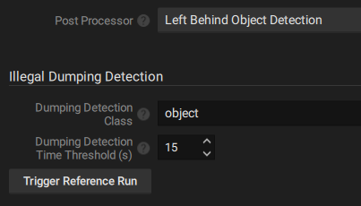

# 4. Other Network Optix Plugin Settings

The Network Optix plugin contains several settings to manage the behavior.&#x20;

Navigate to the camera settings and enable the Nx AI Manager Plugin. The following settings should appear:&#x20;

* Device active
* Manage Device
* Reselect Runtime
* Model settings
* Video settings
* Input Masks
* Class visualisation

## Device Active

If this switch is enabled, the frames from this device's video stream will be sent to the AI Manager for inference. The AI Manager runs as a separate process on the server, and is started if at least one device on the server has this setting enabled.

This setting is off by default. This allows you to configure your device, assign a model pipeline, and then enable the device for the first time.

## Manage Device

This button opens the Nx AI Manager Client popup. In the Nx AI Manager Client can add model pipelines, and manage the models and their details here.

## Reselect Runtime

An option to switch between different acceleration runtimes. For example if your device has a built in NPU and the runtime for that is not working correctly, you might switch to a CPU based runtime until the NPU runtime is fixed.

## Device Overview

A compact overview of the device's settings, including information such as which acceleration runtime is active, and an overview of the assigned pipelines.

## Video Settings

Contains settings related to how the input frames should be processed for the AI Manager.

### Resize Method

In nearly all cases, the video stream will not be the same resolution as the model's input. While the frame can easily be resized, if the aspect ratio is different there are a couple of ways to adapt the input frames to the aspect ratio the model expects:

* **Letterbox:** ( default ) The AI Manager will add black bars to the sides or the top and bottom of the frame to correct the aspect ratio for the model.
* **Stretch**: The frame will be stretched to the aspect ratio of the model. This could influence the performance of the model if the aspect ratios are significantly different.
* **Crop:** The sides or top and bottom of the frame is cut off to fit the input frame to the aspect ratio of the model. This could mean that detections on the edge of the frame will be missed.

## Postprocessors

The NX AI Manager platform provides a number of built-in standard postprocessors for convenience. It also allows advanced users to create and add their own custom postprocessors, see [7.1-external-post-processing.md](7.-advanced-configuration/7.1-external-post-processing.md "mention")

When building a pipeline, a dropdown list is provided with all postprocessors available on that server, including the custom external postprocessors. When one of these is selected, its settings will become available in the Plugin UI.

### Loitering Detection

The NX AI Manager has the functionality to detect loitering. This is a tool to detect if a certain object is detected for longer than the desired amount of time.

It is generally recommended to use loitering detection in tandem with feature extraction, since Identity models generate vectors for their input images, it is useful to first detect objects in a frame, and then send these extracted sub-frames to the Identity model for identification.

Once it is detected that this subject is loitering, a bounding box of the type Loiterer will be generated to clearly show where this is happening.

<figure><figcaption>
Loitering Detection Settings
</figcaption></figure>

**Loiter Detection Time Threshold:** A subject detected for at least this amount of time, in seconds, will be considered loitering.

**Loiter Detection Forget Threshold:** When a subject has not been detected for at least this amount of time, in seconds, it will be forgotten. If the same object returns after this amount of time, it will be considered as a new detection.

### Left Behind Object Detection

Illegal dumping detection works by comparing the bounding boxes of a model to a reference. Detected objects which are not in the reference are tracked and timed. If these objects persist for longer than the threshold time they are flagged as dumped objects.&#x20;

Left behind objects are presented as standard bounding boxes with the 'dumped' type. It is therefore advised to create an event in NX to raise an alarm of a 'dumped' type object is detected.

By default, a reference image will be created from the first frame the Nx Edge AI Manager receives when starting up for the first time. This reference image will then be saved and reused in future runs. It is also possible to manually create a reference image.

When the frame is empty of temporary objects and a good representation of the background is being displayed, make use of the "Trigger Reference Run" button to set the new reference. Once the button is pressed, the following frame(s) will be used to set a new reference.

<figure><figcaption>
Left Behind Object Detection settings
</figcaption></figure>

**Dumping Detection Class:** The class of objects to run the postprocessor on. This is useful if you have a model which detects multiple types of objects, but you only want to check for left behind objects on a specific class, for example 'backpack'.

**Dumping Detection Time Threshold:** The amount of time ( in seconds ) an object of the desired class has to be in frame and completely stationary before it is flagged as a dumped object.

**Trigger Reference Run:** A button to trigger a reference run. When clicked, the following frame(s) will be used to create a new reference, the previous reference will be discarded.

Left behind object detection is compatible with any model which generates bounding boxes.

### Line Crossing Detection

Line crossing detection can be used to detect or count objects which cross a defined line. The postprocessor works by tracking objects through the frames, and detect when this object crosses a line, and the direction.

<figure><figcaption>
Line Crossing  Detection settings
</figcaption></figure>

Make use of the NX interface to draw a line on the video frame and click 'Apply' for changes to take effect.

When a crossing is detected, an event is generated. This event can be configured to trigger any action. See [#adding-event-rules](3.-configure-the-nx-ai-manager-plugin/#adding-event-rules "mention") .

<figure><figcaption>
Line Crossing Detection event configuration
</figcaption></figure>

Note that the Line Crossing Detection postprocessor may have to be selected, and 'Apply' button clicked, before the event can be made.

Line Crossing Detection is compatible with any model which generates bounding boxes.

### Object Counting

The Object Counting postprocessor is useful for models which generate bounding boxes but not counts outputs, see [#supported-onnx-model-outputs](../for-data-scientists/onnx-requirements.md#supported-onnx-model-outputs "mention").

This postprocessor will count all the bounding boxes per class and create a counting event.

<figure><figcaption>
Objects Counted event configuration
</figcaption></figure>

Object Counting postprocessor is compatible with any model which generates bounding boxes.

## Input Masks

Some models accept input masks, see [#inputs-specification](../for-data-scientists/onnx-requirements.md#inputs-specification "mention"). It is possible to create these masks on the video frame inside the plugin settings.

<figure><figcaption>
Input Masks setting
</figcaption></figure>

Click 'Apply' for changes to take effect.

## Class Visualisation

It is sometimes desired to control which types of objects get visualised, and which to ignore. This is useful if you have a model which detects many class types, but you are only interested in some of them.&#x20;

<figure><figcaption>
Class Visualisation setting
</figcaption></figure>

A list of checkboxes are presented. This list is generated from the named output of the assigned models. See [#supported-onnx-model-outputs](../for-data-scientists/onnx-requirements.md#supported-onnx-model-outputs "mention"). If a new model is assigned to the NX AI Manager, it might be necessary to click the 'Refresh' button to see the changes.

Click 'Apply' for changes to take effect.
