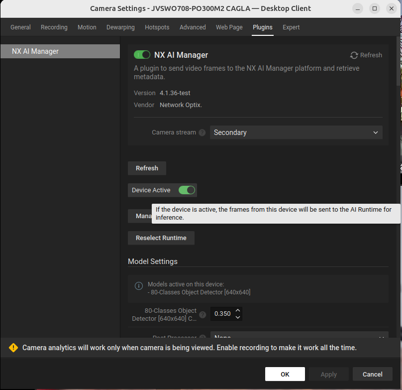

# Controlling the server and the plugin

## Start the server

The mediaserver will usually be started automatically when the computer it is installed on is started.

However it also can be started manually from the command line with either of the following commands:

```sh
sudo service networkoptix-metavms-mediaserver start
```

```sh
sudo systemctl start networkoptix-metavms-mediaserver.service
```

## Restarting the server

Restarting the server can be done on the command line too.

```sh
sudo service networkoptix-metavms-mediaserver restart
```

```sh
sudo systemctl restart networkoptix-metavms-mediaserver.service
```

But it can also be done on the built-in NX Meta Server web interface by accessing the webpage at port `:7001` for instance, at `https://localhost:7001/` or use the IP address for localhost `https://127.0.0.1:7001/`  or use your external IP address with the same port.&#x20;

<figure><figcaption></figcaption></figure>

## Stopping the server

Stopping the server on the command line is similar to starting and restarting.

```sh
sudo service networkoptix-metavms-mediaserver stop
```

```sh
sudo systemctl stop networkoptix-metavms-mediaserver.service
```

## Starting the plugin

To start the plugin the plugin needs to be enabled by toggling the switch next to the title and then also enabling the 'Device Active' toggle that will then appear.

<figure><figcaption><p>The popup window showing that the plugin is disabled for this device</p></figcaption></figure>

<figure><figcaption><p>The popup window showing that the plugin is enabled for this device, but the device is not active.</p></figcaption></figure>

## Stopping the plugin

Stopping the plugin when it is running can be done from within the Nx Client.

To stop the plugin all devices on a server need to be disabled by switching the 'Device Active' toggle to off.

<figure><figcaption><p>The popup window showing that the plugin is enabled and the device is active.</p></figcaption></figure>
